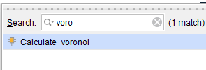

<!-- HEADER -->
# pynq-voronoi-accelerator
Demonstration of hardware acceleration with the PYNQ-Z1 FPGA on a Voronoi diagram, along with other HPC methods.


<!-- TABLE OF CONTENTS -->
### Table of Contents
1. [About the Project](#about-the-project)
2. [Instructions](#instructions)
    1. [Hardware/Software Requirements](#hardwaresoftware-requirements)
    2. [PYNQ Implementation](#pynq-implementation)
    3. [C/Python Implementations](#cpython-implementations)
3. [Usage](#usage)
    1. [Makefile](#makefile)
    2. [Visualization](#visualization)
4. [Results](#results)


<!-- ABOUT THE PROJECT -->
## About The Project
This repository contains code relating to Voronoi diagrams, which partition coordinates within a 2D plane into regions, each associated with a predefined center seed/coordinate. The Euclidean distance between each coordinate on the plane and each seed is calculated and each coordinate is then assigned to the region of the closest seed.

A simplified version of this algorithm is used with fixed problem size and seed values to serve as a constant during testing. Various HPC methods are implemented for comparison of  execution times on different platforms. The primary goal of this research was to explore hardware acceleration using the Digilent PYNQ-Z1 FPGA and evaluate how it performs in comparison to CPU and GPU-based implementations, both parallel and sequential. The following methods were used for comparison:

1. Host Machine  
    1. Python (Sequential)
    2. Python + Numba (Parallel)
    3. C (Sequential)
    4. C + OpenMP CPU (Parallel)
    5. C + OpenMP GPU (Parallel)
2. PYNQ-Z1
    1. FPGA (HLS Overlay)
    2. C (Sequential)
    3. C + OpenMP CPU (Parallel)


<!-- SETUP -->
## Instructions

If anybody wishes to replicate this project to expand on what is done here, or simply test it out for themselves, a comprehensive set of instructions has been included on how to run everything.

### Hardware/Software Requirements

The following hardware and software is needed to deploy the HLS-generated overlay onto the FPGA:

- Digilent PYNQ-Z1 FPGA (v3.0.1 image)
- AMD Vitis HLS (v2023.1)
- AMD Vivado Design Suite (v2023.1)
- Jupyter Notebook (pre-installed on PYNQ-Z1 image)

Here are the specifications for the PYNQ-Z1:

```
--------------------[ PYNQ-Z1 SYSTEM INFORMATION ]--------------------
FPGA Chip:          Xilinx Zynq-7020 (XC7Z020-1CLG400C)
CPU (PS):           ARM Cortex-A9 (dual-core)
PS Clock Speed:     650 MHz
PL Clock Speed:     100 MHz (default FCLK_CLK0)
Cores:              2
Threads per Core:   1
Memory:             512 MiB (shared between PS and PL)
```

The following software is needed for all C and Python implementations:

- Python (v3.12.3)
- pip (v24.0)
- gcc (v13.3.0)
- Optional: gnuplot (v6.0) 

> **NOTE:** Using other software versions of these tools may result in this instruction set not working properly.

Execution times for C and Python implementations (e.g., sequential, Numba, OpenMP) will vary significantly depending on the hardware of the host machine. Below are the specifications of the machine used during testing:

```
--------------------[ HOST MACHINE INFORMATION ]--------------------
Hostname:           XXXXXXXXXXXXXXXXXXXXXXXXX
CPU:                AMD Ryzen 7 4800H with Radeon Graphics
CPU Clock Speed:    2894.595 MHz
Cores:              16
Threads per Core:   2
Memory:             7.4Gi
```

> **NOTE:** Benchmark logs automatically include machine specifications for reproducibility and comparison across machines.

All Python and C files were compiled and executed using Windows Subsystem for Linux (WSL2). The provided [Makefile](Makefile) relies on Linux-specific commands for logging and execution, so it is intended for use within a Linux-based environment. The source code can still be run manually on Windows or macOS if the necessary tools and dependencies are installed.

### PYNQ Implementation

This section describes how to build and deploy the hardware-accelerated Voronoi algorithm as a custom overlay on the Digilent PYNQ-Z1 FPGA using Vitis HLS and Vivado Design Suite.

1. Generate IP using Vitis HLS
    1. Open Vitis HLS and create a new project.
        - Name the project (e.g., voronoi_ip)

            

        - Add the [voronoi_hls.cpp](src/pynq/voronoi_hls.cpp) source file to the project.
        - Set the top function name to your HLS function (calculate_voronoi)

            

        - Set the part to `xc7z020clg400-1`.

            
        
    2. Click "Run C Synthesis" to generate RTL. Make sure there are no errors after completion.

        
        
    
    3. In project directory, go to `.../voronoi_ip/solution1/impl/misc/drivers/calculate_voronoi_v1_0/src/xcalculate_voronoi_hw.h` (the exact path may differ slightly based on names used within project). Here you can find the physical memory addresses of where the function parameters can be written to and where the resulting area matrix can be read. The file will look similar to this:

        

    4. Click "Export RTL", keep the default settings, and save the generated IP.

        
        

2. Build Overlay in Vivado
    1. Open Vivado and create a new project:
        - Name the project (e.g., voronoi_overlay).

            

        - Keep default settings (make sure that RTL project is selected, do not add sources or constraints).

            

        - Set the part to `xc7z020clg400-1`.

            

    2. Add your HLS-generated IP:
        - Go to "Project Manager" > "Settings" > "IP" > "Repository", and add the path of the HLS project.

            

        - Refresh the IP catalog; your IP block should appear.
    3. Create a block design ("IP Integrator" > "Create Block Design").

        

    4. In the diagram:
        - Add ZYNQ7 Processing System

            

            - Add AXI slave to block (Double click on block > "PS-PL Configuration" > Expand "HP Slave AXI Interface" > Enable "S AXI HP0 interface"). 

                

        - Add your custom Voronoi IP.

            

        - Run "Connection Automation" and "Block Automation" to ensure everything connects properly.

            

    5. Run "Validate Design" to check for issues. The block diagram should look similar to this:

        

    6. Create HDL Wrapper (Sources > Right-click design > "Create HDL Wrapper").

        

    7. Run Generate Bitstream ("Program and Debug" > "Generate Bitstream").

        

    8. Once bitstream generation is complete:
        - Go to "File" > "Export" > "Export Bitstream File" and save  `.bit` file to somewhere easily accessible.

            

        - In File Explorer, go to this directory (may be slightly different) within the project `...\voronoi_overlay\voronoi_overlay.gen\sources_1\bd\Voronoi\hw_handoff` and copy the `.hwh` file found within to same place as the `.bit` file.
        - Rename both files so that they have the same name (e.g., "voronoi.bit" and "voronoi.hwh") - this is necessary for the overlay to work correctly.

            

4. Deploy to PYNQ-Z1
    1. Connect the PYNQ-Z1 board to power, and either connect the ethernet port directly to your machine or to your network's router. 
        - Direct connection to the PYNQ-Z1 requires a little more setup (setting a static IP for your machine). A full guide to setting up the PYNQ-Z1 for the first time can be found [here](https://pynq.readthedocs.io/en/v2.2.1/getting_started/pynq_z1_setup.html).
        - Jupyter notebooks can be accessed through the web browser at `http://192.168.2.99:9090` (direct connection) or `http://pynq:9090` (connected via network).
        - Make sure that the image flashed to the microSD card is v3.0.1. In older image versions, an older version of the pynq library and Python 2.7 is used, which require a `.tcl` file to be uploaded and also do not support certain functions.
    2. Upload the `.bit` and `.hwh` files to the PYNQ-Z1.
    3. In the same folder as the `.bit` and `.hwh` files, create a new Jupyter notebook and copy over the blocks of code found within [voronoi_pynq.ipynb](src/pynq/voronoi_pynq.ipynb).
    4. Make sure the `.bit` filename matches the filename argument in this line of code: `ol = Overlay("xxxxxxxxxx.bit")`
    5. Run the notebook and you should see the resulting execution time and visual verification showing that the algorithm worked properly!

    

### C/Python Implementations

This section gives a brief overview of the various C/Python implementations. These are organized within the `src/c/` and `src/python/` directories and include:

- `voronoi_seq.py`: Sequential Python implementation.

- `voronoi_numba.py`: Parallel Python implementation using Numba for multithreading.

- `voronoi_seq.c`: Sequential C implementation.

- `voronoi_omp.c`: Parallel C implementation using OpenMP for multithreading.

- `voronoi_omp_gpu.c`: Parallel C implementation using OpenMP for GPU offloading (system must support GPU operations).

Each file is extremely similar in structure; memory is allocated for the resulting plane, Euclidean distances are calculated for each coordinate on the plane, and each coordinate is placed into the appropriate Voronoi regions. Each file outputs the resulting execution time and problem size.

To run these implementations, each file's header contains the necessary compilation arguments for manual execution, or they can be run using the provided [Makefile](Makefile) (see following section). 

Due to the clock speed differences between the host machine used for this project and the PYNQ-Z1, the sequential C and parallel C + OpenMP CPU implementations were also executed on the PYNQ-Z1 for a better comparison.

## Usage

### Makefile
A [Makefile](Makefile) is provided to help automate the process of compiling, executing, and benchmarking the various HPC implementations. Specifically, this includes creating the Python virtual environment, compiling the C source files into binaries, executing each, and recording the output with relevant system information in a log file. To do this, simply run `make` from the top-level directory.

If you wish to remove the existing virtual environment, binary files, and logs, run `make clean`. This can be split into separate commands if you do not wish to remove everything all at once.
```sh
make clean_venv
make clean_bin
make clean_logs
make clean_gnu
```

### Visualization
To visualize what the Voronoi algorithm looks like on a 2D plane, the Numba parallelized Python implementation was used in [voronoi_visual.ipynb](src/dev_tools/voronoi_visual.ipynb) along with matplotlib. As an additional visualization method, [voronoi_visual.c](src/dev_tools/voronoi_visual.c) has been included to play around with. This code uses the OpenMP parallelized C implementation combined with GNUplot for visualization, allowing customization of the number of seeds and also randomization of where they are placed on the plane. You can run `make graph` in the top-level directory to compile and run this code. 

> **NOTE:** The GNUplot visualization was mainly included for my personal benefit (broadening my programming skills with C tools/libraries). It requires GNUplot to be installed before running using `sudo apt-get install gnuplot`. GNUplot also takes much longer to run than the Python visualization, which is the recommended method.

To visualize the timing differences between implementations, [timing_comparison.ipynb](src/dev_tools/timing_comparison.ipynb) was created to scrape values from a user-selected log file and display the resulting times in a bar-graph. The sequential Python implementation take much longer than the others to run, making it difficult to visualize the timing differences between the PYNQ and C implementations, so there is an option to select which implementations are plotted by selecting them within the plotly legend.

> **IMPORTANT:** The recorded times for all PYNQ implementations need to be manually updated within [Makefile](Makefile) using `PYNQ_TIME`, `PYNQ_SEQ_C_TIME`, and `PYNQ_OMP_C_TIME` variables. Due to the limitations of the PYNQ web server environment, I was unable to find a feasible method of recording the PYNQ execution times within a log file automatically.


<!-- RESULTS -->
## Results

The performance of each Voronoi implementation was evaluated using a fixed problem size of 4096×4096 and a consistent seed layout (one seed in each corner of 2D plane). The resulting Voronoi diagram looks like this:


Below contains a comprehensive list of execution times for each of the implementations. All results used fixed inputs and were run in consistent environments. The log that includes the shown times and relevant system information can be viewed [here](src/dev_tools/results.log).

### Host Machine (AMD Ryzen 7 4800H @ 2.9 GHz)

| Method  | Problem Size | Time (sec) |
| ------------- | ------------- | ------------- |
| C (Sequential) | 4096 | 0.196247 |
| C + OpenMP CPU (Parallel) | 4096 | 0.058189 |
| C + OpenMP GPU (Parallel) | 4096 | 0.075866 |
| Python (Sequential) | 4096 | 433.844122 |
| Python + Numba (Parallel) | 4096 | 1.778547 |

### PYNQ-Z1 (ARM Cortex-A9 @ 650 MHz (PS) | FPGA fabric @ 100 MHz (PL))

| Method  | Problem Size | Time (sec) |
| ------------- | ------------- | ------------- |
| C (Sequential) | 4096 | 6.573427 |
| C + OpenMP CPU (Parallel) | 4096 | 3.583120 |
| FPGA (HLS Overlay) | 4096 | 0.605872 |

Here is a plot showing a comparison of all the execution times:


As expected, the sequential Python implementation takes significantly longer to execute than any of the other methods. To better visualize the difference in execution times between implementations, the sequential Python result has been excluded in the following graph:


The C-based implementations on the host machine were by far the fastest overall. However, comparing these platforms based on execution time alone is somewhat misleading. This timing difference can largely be attributed to the host’s significantly higher CPU clock speed (2.9 GHz) compared to the 650 MHz Processing System (PS) and 100 MHz Programmable Logic (PL) on the PYNQ-Z1.

Due to the difference in clock speeds, the PYNQ-Z1 also consumes significantly less power than the host machine's CPU. While energy usage measurements were not taken, future work could explore profiling the power consumption on both platforms to provide a more in-depth evaluation. One identified limitation of the HLS overlay approach is that the output memory buffer size scales with problem size, and due to the PYNQ-Z1's limited 512 MiB shared memory, extremely large grids may exceed available memory. In practice, this limits the maximum grid size that can be processed without custom memory management or stream-based architectures. This constraint does not apply to the host system for the problem sizes being used in this project, which has significantly more RAM available.

Isolating the implementations performed with the PYNQ-Z1 FPGA can provide a better understanding of the impact of the HLS overlay: 


This chart clearly shows that the HLS overlay executes considerably faster than both the sequential and OpenMP C implementations when executed on the PYNQ-Z1, despite the overlay operating at a lower clock frequency (overlay uses the PL 100 MHz clock and C implementations use the PS 650 MHz clock). 

Overall, this project demonstrates that hardware acceleration using HLS on the PYNQ-Z1 can deliver strong performance improvements over software-only implementations on the same device. While the Voronoi diagram execution times on the PYNQ-Z1 may not match the speed of a high-end CPU, the FPGA overlay achieves efficient, scalable performance with a significantly lower power usage.